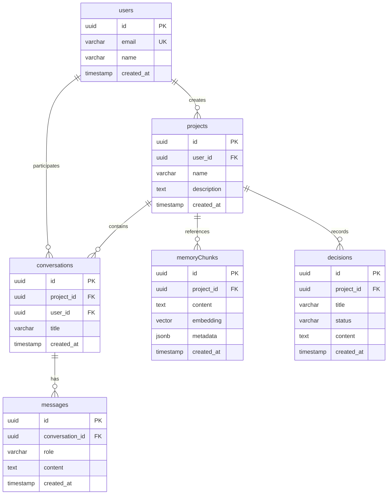
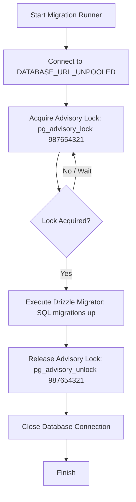
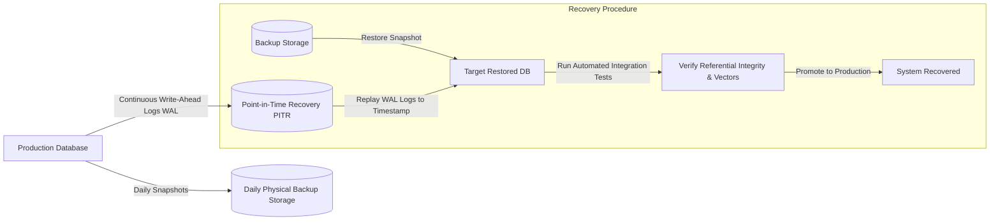

# DevBrain Database Architecture & Relationships

This document contains the ER diagram, relationship mapping, migration control flow, and backup/restore diagrams for the DevBrain production database layer.

---

## 1. Entity-Relationship Diagram (ERD)

---

## 2. Migration Flow Diagram with Advisory Locking

---

## 3. Backup and Disaster Recovery Flow

---

## 4. Database Schema Specifications

### users
*   **Purpose**: Records application users.
*   **Primary Key**: `id` (UUID, defaults to `gen_random_uuid()`).
*   **Unique Index**: `email` (non-null, VARCHAR(255)).

### projects
*   **Purpose**: Logical workspaces grouping conversations, vector memory chunks, and decisions.
*   **Foreign Key**: `user_id` referencing `users(id)` with `ON DELETE CASCADE`.
*   **Index**: B-Tree on `user_id` to speed up project dashboard loads.

### conversations
*   **Purpose**: Logically records interaction history trees between a developer and DevBrain agents.
*   **Foreign Keys**: 
    *   `project_id` referencing `projects(id)` `ON DELETE CASCADE`.
    *   `user_id` referencing `users(id)` `ON DELETE CASCADE`.
*   **Composite Index**: `(user_id, project_id, created_at)` to optimize prompt contextual retrievals.

### messages
*   **Purpose**: Individual message exchanges in a conversation thread.
*   **Foreign Key**: `conversation_id` referencing `conversations(id)` `ON DELETE CASCADE`.
*   **Index**: B-Tree on `conversation_id`.

### memoryChunks
*   **Purpose**: Stores parsed code elements and document sections with vector representations.
*   **Foreign Key**: `project_id` referencing `projects(id)` `ON DELETE CASCADE`.
*   **pgvector Config**: 768-dimension embedding array utilizing `cosine` distance metric operators.
*   **HNSW Index**: Configured with `vector_cosine_ops` to enable approximate nearest neighbor indexing.

### decisions
*   **Purpose**: Stores structured engineering design decisions (ADRs) generated by the agent.
*   **Foreign Key**: `project_id` referencing `projects(id)` `ON DELETE CASCADE`.
*   **Index**: B-Tree on `project_id`.
